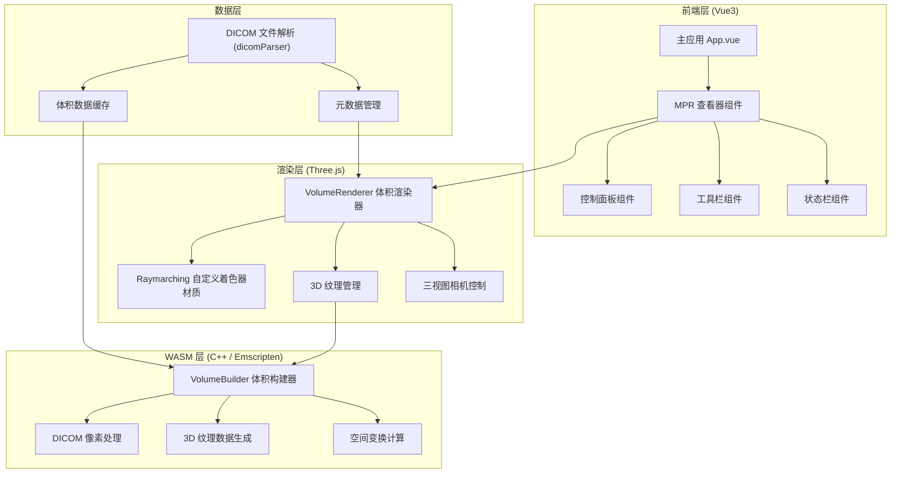

## 1. 架构设计



## 2. 技术说明

### 2.1 前端技术栈
- 框架：Vue 3 + Vite 5
- 语言：TypeScript
- 样式：SCSS + CSS Variables
- 3D 渲染：Three.js (r160+)
- DICOM 解析：dicomParser
- 状态管理：Vue Composition API (reactive/ref)
- 构建工具：Vite + vite-plugin-wasm

### 2.2 WASM 技术栈
- 语言：C++17
- 编译器：Emscripten 3.1.50+
- 构建工具：CMake + Emscripten toolchain
- 内存管理：Emscripten HEAP (SharedArrayBuffer 可选)
- 接口：Embind 导出 C++ 类到 JS

### 2.3 核心技术方案
1. **3D 纹理构建**：C++ WASM 模块接收 DICOM 像素数据，构建高密度 3D 纹理体积块，输出 Uint16Array 格式的体素数据
2. **Raymarching 着色器**：Three.js 使用自定义 ShaderMaterial，通过 raymarching 算法对 3D 纹理进行采样，实现任意平面的切面渲染
3. **MPR 三视图**：轴状面 (Z轴)、矢状面 (X轴)、冠状面 (Y轴) 三个正交视角，每个视角对应一个独立的渲染器与相机
4. **窗宽窗位**：在片元着色器中实现 WW/WL 变换，实时调节对比度与亮度

## 3. 目录结构

```
dicom-mpr-viewer/
├── public/
│   └── wasm/              # 编译后的 WASM 文件
├── src/
│   ├── components/        # Vue 组件
│   │   ├── MPRViewer.vue  # 主查看器组件
│   │   ├── ControlPanel.vue
│   │   ├── Toolbar.vue
│   │   └── StatusBar.vue
│   ├── composables/       # 组合式函数
│   │   ├── useVolume.ts   # 体积数据管理
│   │   ├── useMPR.ts      # MPR 逻辑
│   │   └── useDICOM.ts    # DICOM 解析
│   ├── rendering/         # Three.js 渲染相关
│   │   ├── VolumeRenderer.ts
│   │   ├── shaders/       # GLSL 着色器
│   │   │   ├── raymarch.vert
│   │   │   └── raymarch.frag
│   │   └── CameraController.ts
│   ├── wasm/              # WASM 封装
│   │   ├── volume.cpp     # C++ 源码
│   │   └── volume.d.ts    # TypeScript 类型声明
│   ├── types/             # TypeScript 类型定义
│   ├── utils/             # 工具函数
│   ├── App.vue
│   └── main.ts
├── wasm/                  # WASM 源码与构建
│   ├── CMakeLists.txt
│   └── src/
│       ├── VolumeBuilder.h
│       ├── VolumeBuilder.cpp
│       └── binding.cpp
├── index.html
├── package.json
├── vite.config.ts
└── tsconfig.json
```

## 4. 核心数据结构

### 4.1 体积数据 (VolumeData)
```typescript
interface VolumeData {
  dimensions: {
    width: number;   // X 轴像素数
    height: number;  // Y 轴像素数
    depth: number;   // Z 轴切片数
  };
  spacing: {
    x: number;       // X 方向像素间距 (mm)
    y: number;       // Y 方向像素间距 (mm)
    z: number;       // Z 方向切片间距 (mm)
  };
  voxelData: Uint16Array;  // 16-bit 体素数据
  metadata: DICOMMetadata; // DICOM 元数据
}
```

### 4.2 MPR 视图状态 (MPRViewState)
```typescript
interface MPRViewState {
  plane: 'axial' | 'sagittal' | 'coronal';
  sliceIndex: number;      // 当前切层索引
  windowWidth: number;     // 窗宽
  windowLevel: number;     // 窗位
  zoom: number;            // 缩放比例
  pan: { x: number; y: number };  // 平移偏移
}
```

### 4.3 DICOM 元数据 (DICOMMetadata)
```typescript
interface DICOMMetadata {
  patientName: string;
  studyDate: string;
  modality: string;
  seriesDescription: string;
  sliceThickness: number;
  imagePositionPatient: number[];
  imageOrientationPatient: number[];
  pixelSpacing: number[];
}
```

## 5. WASM 模块接口

### 5.1 VolumeBuilder 类 (C++ 导出)
```cpp
class VolumeBuilder {
public:
  // 构造函数
  VolumeBuilder(int width, int height, int depth);
  
  // 设置像素间距
  void setSpacing(float sx, float sy, float sz);
  
  // 添加一层切片数据
  bool addSlice(int zIndex, const uint16_t* sliceData, int sliceSize);
  
  // 构建 3D 体积纹理
  bool buildVolume();
  
  // 获取体素数据指针
  uint16_t* getVoxelData() const;
  
  // 获取体积尺寸
  int getWidth() const;
  int getHeight() const;
  int getDepth() const;
  
  // 获取指定位置的体素值
  uint16_t getVoxel(int x, int y, int z) const;
  
  // 三线性插值采样
  float sampleVolume(float x, float y, float z) const;
};
```

### 5.2 JS 封装接口
```typescript
export interface VolumeWASM {
  VolumeBuilder: {
    new (width: number, height: number, depth: number): VolumeBuilderInstance;
  };
  _malloc(size: number): number;
  _free(ptr: number): void;
  HEAPU16: Uint16Array;
}

export interface VolumeBuilderInstance {
  setSpacing(sx: number, sy: number, sz: number): void;
  addSlice(zIndex: number, sliceDataPtr: number, sliceSize: number): boolean;
  buildVolume(): boolean;
  getVoxelData(): number;
  getWidth(): number;
  getHeight(): number;
  getDepth(): number;
  delete(): void;
}
```

## 6. 着色器设计

### 6.1 Raymarching 片元着色器核心逻辑
- 输入：3D 纹理采样器、切面平面方程、窗宽窗位参数
- 输出：切面上的灰度像素值
- 算法：沿视线方向对 3D 纹理进行三线性插值采样

### 6.2 关键 Uniform 变量
```glsl
uniform sampler3D u_volumeTexture;   // 3D 体积纹理
uniform vec3 u_volumeDimensions;     // 体积尺寸
uniform vec3 u_volumeSpacing;        // 体素间距
uniform float u_windowWidth;         // 窗宽
uniform float u_windowLevel;         // 窗位
uniform vec4 u_planeEquation;        // 切面方程 (ax + by + cz + d = 0)
uniform mat4 u_planeMatrix;          // 切面变换矩阵
```

## 7. 性能优化策略

1. **WASM 并行构建**：使用 Web Worker 在后台线程构建体积数据
2. **纹理压缩**：考虑使用 WebGL 压缩纹理扩展 (可选)
3. **LOD 策略**：远距离浏览时降低采样率
4. **内存管理**：及时释放不再使用的 DICOM 原始数据
5. **requestAnimationFrame**：仅在视图变化时触发重渲染
